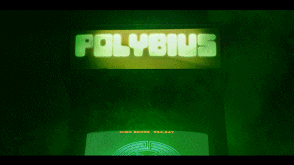

# Polybius: The Killer Arcade Game

Polybius is a legendary 1980s arcade machine rumored to hypnotize players, causing obsession, disorientation, and strange side effects. While likely a myth, it symbolizes fears of addictive games, psychological manipulation, and technology’s unseen influence—and continues to inspire games, stories, and internet lore.
